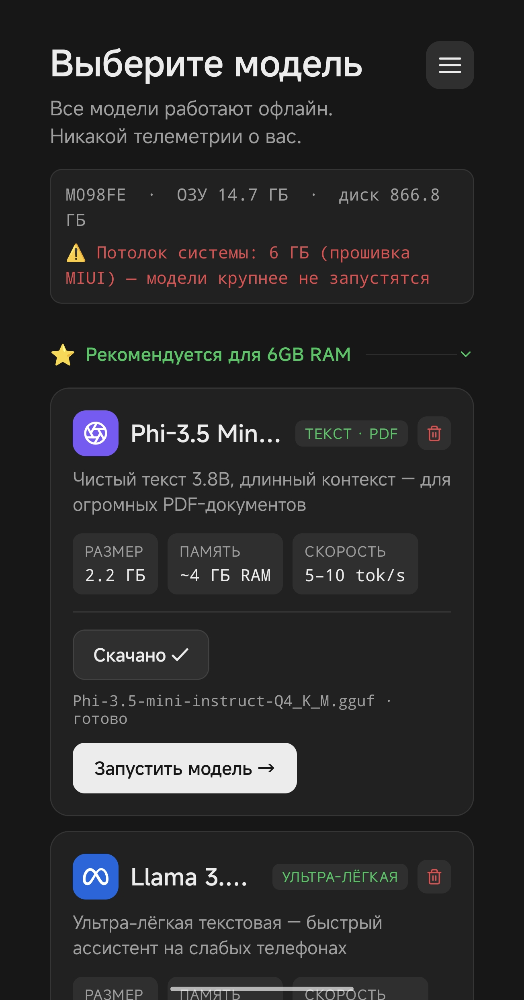
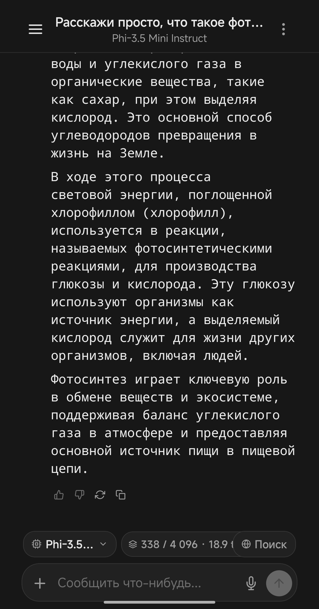
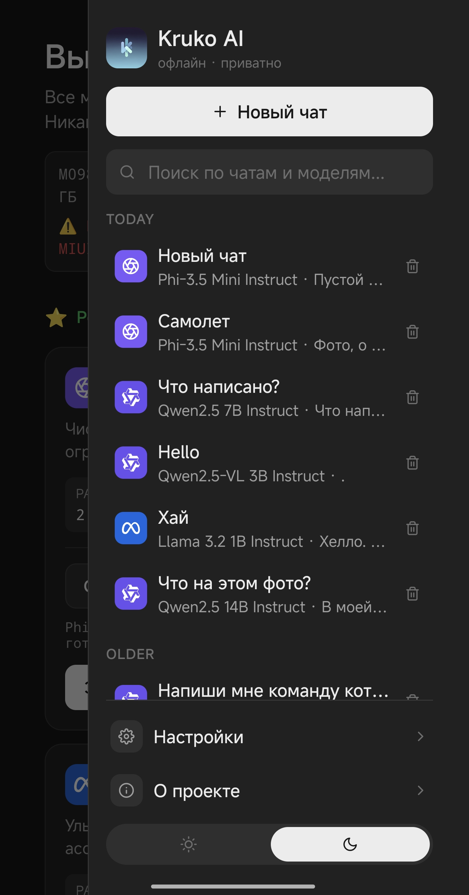
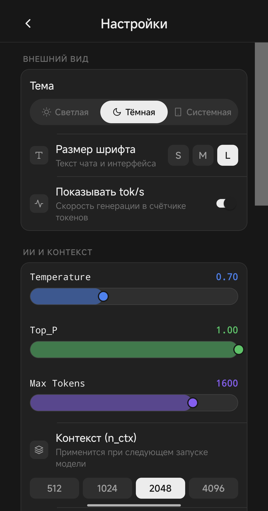
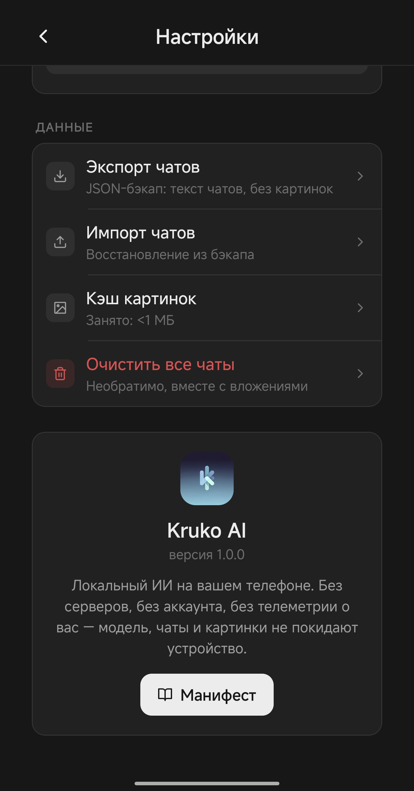
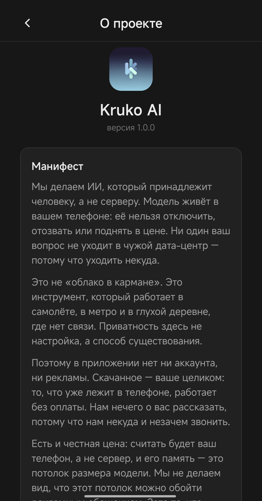

# KrukoAI

**Офлайн-ИИ прямо в телефоне.** Модель на 8 миллиардов параметров, сжатая до 1.58 бита на вес,
лежит в памяти устройства и отвечает, не отправив в сеть ни одного байта.

Здесь только готовые сборки. Исходный код закрыт, и это осознанно: но этот репозиторий —
официальный канал релизов и баг-трекер, так что вопросы и баги приветствуются в Issues.

---

## Скачать

Актуальная версия — в разделе **[Releases](https://github.com/ggarembroo/krukoai-releases/releases/latest)**.

| | |
|---|---|
| Файл | `krukoai-1.0.0.apk` |
| Размер | ~150 МБ |
| Android | 8.0 и новее |
| Подпись | собственный ключ, не Google Play |

## Что внутри

- **Работает без интернета.** Ни загрузки модели, ни ответа — ни одного запроса. Включите
  режим полёта и убедитесь: приложение продолжит работать так же. Проверяется за минуту.
- **Ни аккаунта, ни телеметрии, ни рекламы.** Нам нечего о вас рассказать, потому что нам
  некуда и незачем звонить.
- **Модель не фильтрует ответы.** Что спросили — то и ответит.
- **Считает процессор телефона.** Без видеокарты и без облака: 8B параметров в тернарном
  формате занимают 2,3 ГБ вместо ~16 ГБ в FP16.

## Скриншоты

| Выбор модели | Диалог |
|---|---|
|  |  |

| Список чатов | Настройки |
|---|---|
|  |  |

| Данные | О приложении |
|---|---|
|  |  |

## Установка

1. Скачайте `.apk` из раздела Releases.
2. Откройте файл. Android спросит разрешение на установку из неизвестного источника —
   это ожидаемо: сборка подписана собственным ключом, а не Google Play.
3. Разрешите и дождитесь окончания установки.

**Модель в комплект не входит.** Она скачивается один раз при первом запуске — или
импортируется из файла, если вы уже держите `.gguf` в телефоне, — и остаётся там навсегда.
После этого интернет не нужен ни для ответов, ни для загрузки модели в память.

## Честно о качестве

Это ранняя версия. Она работает, но в ней возможны сбои, и обещать стабильность как
у зрелого продукта мы не станем. Если что-то сломалось — заведите Issue: укажите модель
телефона, версию Android и что именно вы делали. Это правда помогает.

Отдельно про память: считать будет ваш телефон, а не сервер, и его память — это потолок
размера модели. На части прошивок (например, MIUI) система убивает приложение раньше,
чем заканчивается память: приложение показывает этот потолок прямо на экране выбора
модели и предупреждает, какие модели не запустятся.

## Ответственность

KrukoAI распространяется напрямую и без фильтров. Всё, что вы делаете с его помощью,
остаётся на вашей ответственности.
